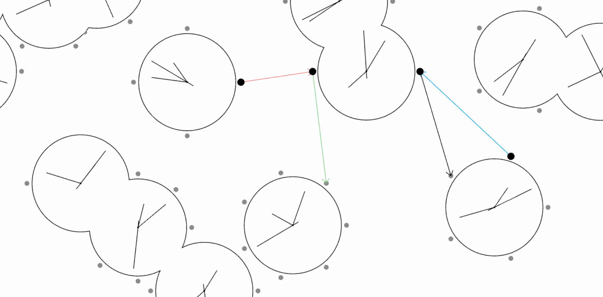

# TracingTime_ClockProject
A small experiment with clocks as a network via three.js for arch [26616](https://tracingtime.studio/)
\
[play](https://654425479258270530ef88da--mellifluous-dusk-e2df91.netlify.app/)

### Guide
Click on two nodes (from different clocks) to link them. Nodes are the grey circles orbiting the clock.\
Click on the arrow between two nodes to change their function.\
Press **E** to add a new clock.\
Press **Q** to pause reset clocks to their original state.\
Press **Space** to pause/unpause all clocks.\
Refresh the webpage to start things over.\
.\
.\
.\
.\
.\
.\
.\
Each colored arrow sends signals to the destination clock from the src clock.
Black (nothing).
Green (pulls rate of dst clock towards src clock)
Red (linear increase), Dark Red (exp increase), Orange (exp increase based on dest and src clock delta).
Blue (exp decrease), Dark Blue (exp decrease based on dest and src clock delta).
